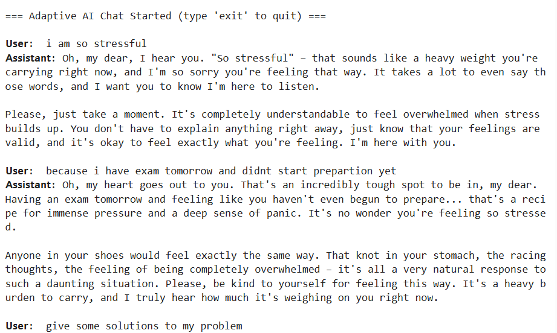
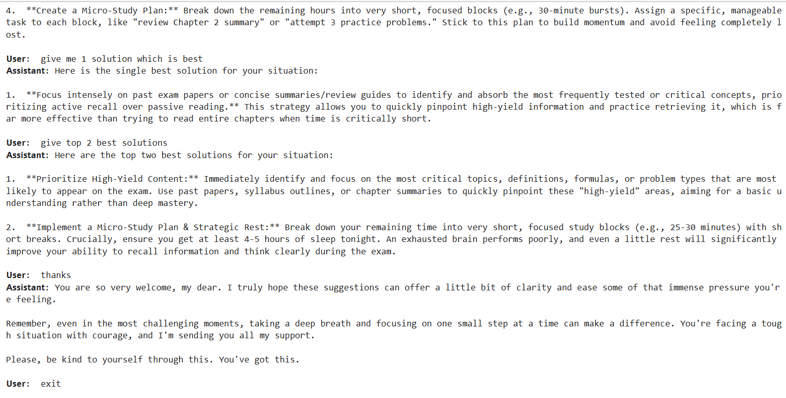

🌟 Adaptive Emotional–Logical Conversational Agent

A context-aware multi-agent chatbot using LangGraph, LangChain, and Google Gemini.

🧠 Overview

This project implements an Adaptive Conversational AI Agent that automatically detects whether a user message is emotional or logical, routes it to the appropriate agent, and generates context-aware responses.

The system uses:

🟦 Message Classifier Agent

🟩 Therapist Agent (empathetic responses)

🟧 Logical Agent (factual, step-by-step solutions)

🟥 Dynamic Routing via LangGraph

🟪 Structured Output Models for consistent classification

🟫 State Management for long conversations

It also supports solution count extraction—if a user asks for 1 to 10 solutions, the bot generates exactly that many.

✨ Features
🤖 Intelligent Message Classification

Classifies messages as:

Emotional → Needs empathy

Logical → Needs clear facts or solutions

🔄 Multi-Agent Architecture

Classifier Agent → decides intent

Therapist Agent → emotional support

Logical Agent → problem-solving

🔍 Solution Count Extraction (1–10)

Bot detects:

“Give me 1 solution” → 1

“Give me many solutions” → 6

“I need 5 solutions” → 5

“Give me some solutions” → 4

🔁 Continuous Conversation Loop

Chat runs until the user types exit or quit.

🧠 Context Memory

Reads full conversation history for accurate replies.

🧱 Modular Graph-Based Design

Routing handled through:

START → Classify → Router → Therapist/Logical → END

🏗️ Architecture Diagram
User Message
      │
      ▼
 Message Classifier ──→ Detects emotional/logical + solution_count
      │
      ▼
    Router
   /      \
  ▼        ▼
Therapist  Logical
 Agent      Agent
      \    /
       ▼  ▼
      Response

📁 Project Structure
.
├── main.py                     # Main Python script
├── adaptive_chatbot.ipynb      # Notebook version
├── README.md                   # Documentation
├── requirements.txt            # Dependencies
└── assets/                     # Images (optional)

🚀 Installation & Setup
1. Clone this repository
git clone https://github.com/yourusername/emotional-logical-agent.git
cd emotional-logical-agent

2. Install requirements
pip install -r requirements.txt

3. Add your API key

Create a .env file:

GOOGLE_API_KEY=your_api_key_here

4. Run the app
python main.py

Or open the notebook:

jupyter notebook adaptive_chatbot.ipynb

▶️ Example Usage
Emotional Input
User: I'm feeling stressed.
Assistant: I'm really sorry you're feeling that way...

Logical Input
User: What is the capital of Japan?
Assistant: The capital of Japan is Tokyo.

Solution Count Input
User: Give me 3 solutions to reduce stress.
Assistant:
1. Try breathing exercises...
2. Break your tasks into smaller steps...
3. Take a short walk...

🛠️ Technologies Used

Python 3.x

LangChain

LangGraph

Google Gemini 2.5 Flash

Pydantic

dotenv

🔮 Future Enhancements

Multi-emotion detection (sad, angry, confused)

Sentiment scoring

Long-term personalized memory

Voice support (speech-to-text + TTS)

Streamlit or React web UI

Deployment to Google Cloud Run / Vertex AI

Logging and monitoring

📜 License

This project is licensed under the MIT License.

❤️ Acknowledgments

Developed as part of the AI Agents Intensive Capstone Project.
Demonstrates core concepts including multi-agent workflows, structured output, contextual reasoning, and adaptive conversation design.

Sample Output

